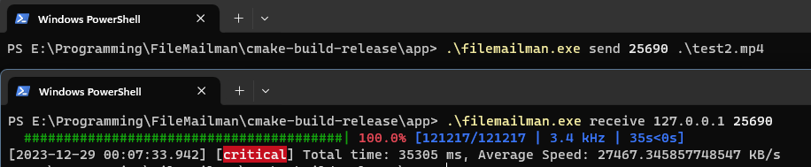

# FileMailman
This is a prototype project for file transferring based on UDP.
# Build
This project is built with CMake(I use MinGW Makefiles and ninja to build), and is designed for Windows.
# Usage
Only command line is supported. The Sender should be launched first, then the Receiver.
- Sender
    ```
    .\filemailman.exe send [port] [file_path]
    ```
- Receiver
    ```
    .\filemailman.exe receive [ip] [port]
    ```

# How it works
- Udp eventloop based on boost::asio
- Basic RUDP: implements timeout retry
- File partition: split the file into blocks(a block occupies sequential memory), split a block into slices(a slice only a view to the corresponding memory of the block).
- Multithread File transfer: transfer all slices in parallel, when all slices in the block is received, continue with the next block.

There is still many bugs remained to be solved. And more tests should be added in the future.

# To Do
- [ ] refine log system
- [x] make it multithreaded
- [ ] add gui
- [ ] refine rudp implementation
- [ ] make it "more multithreaded"